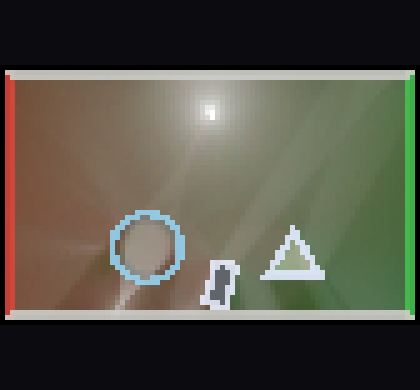
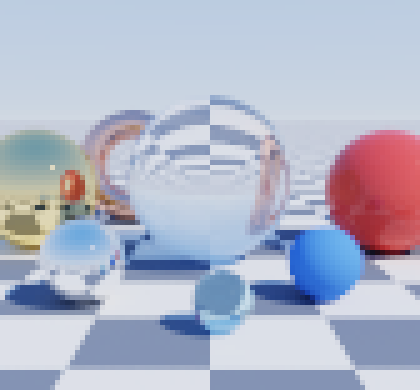
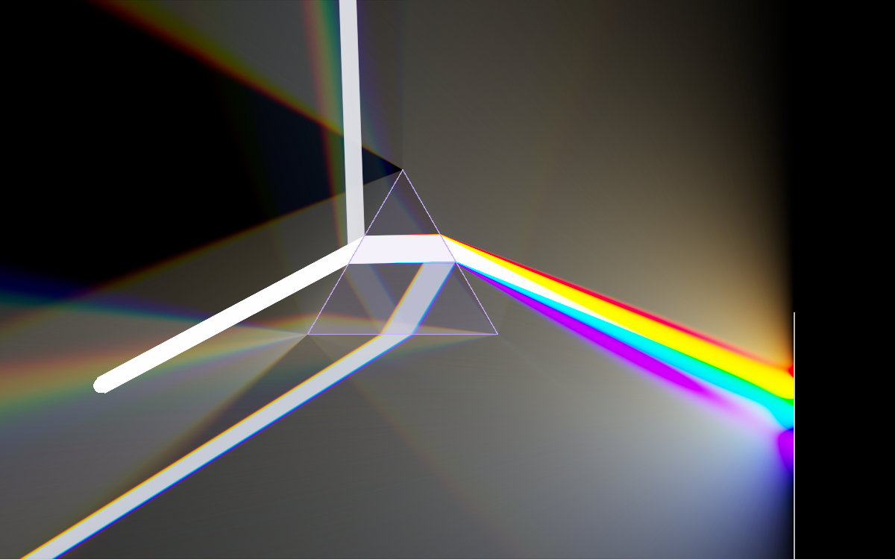
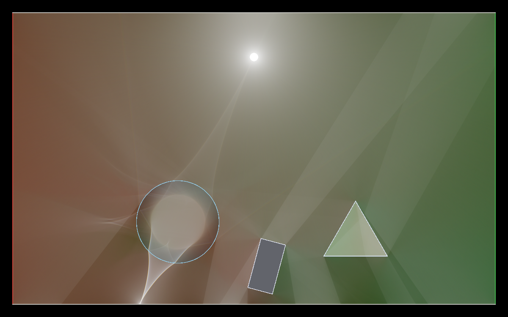
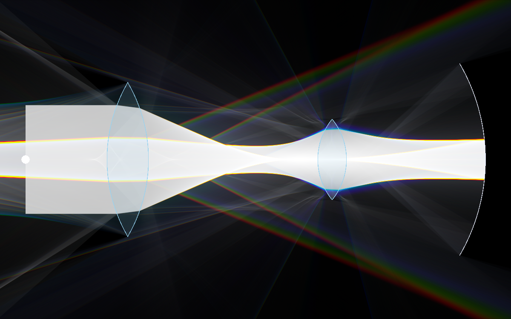
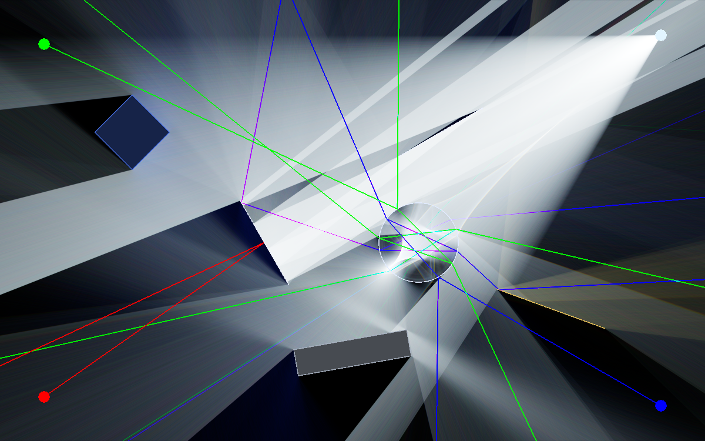
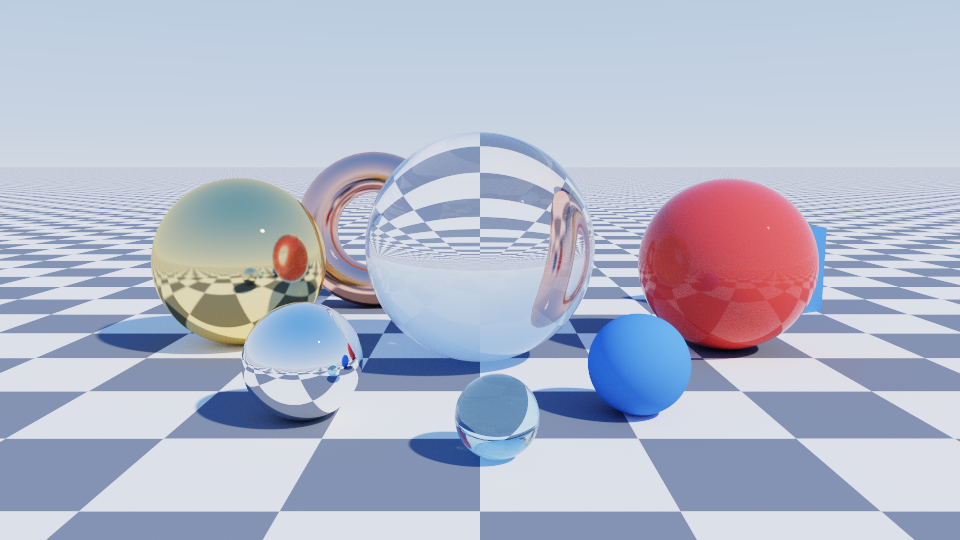
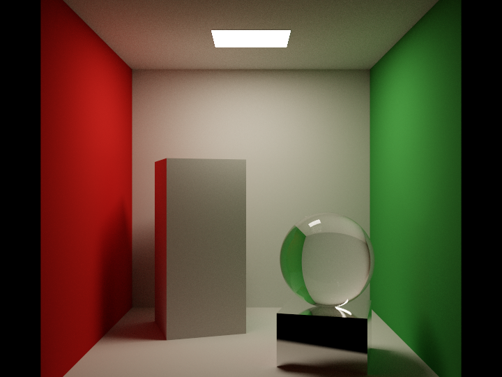
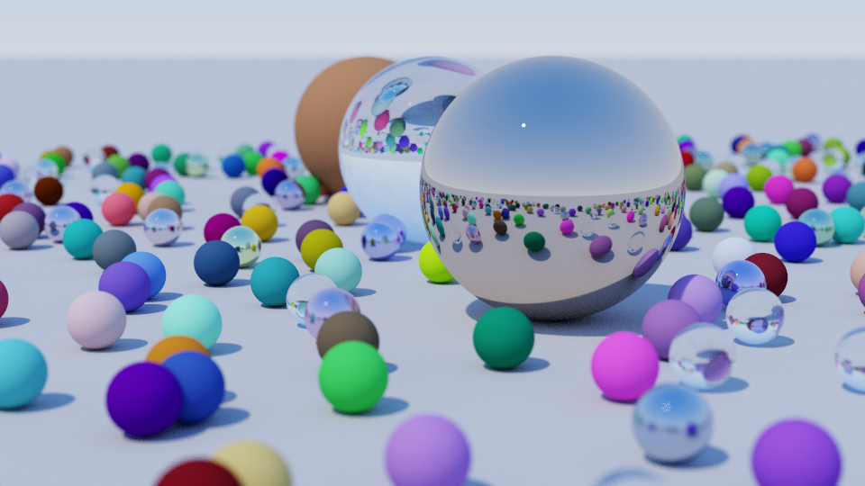
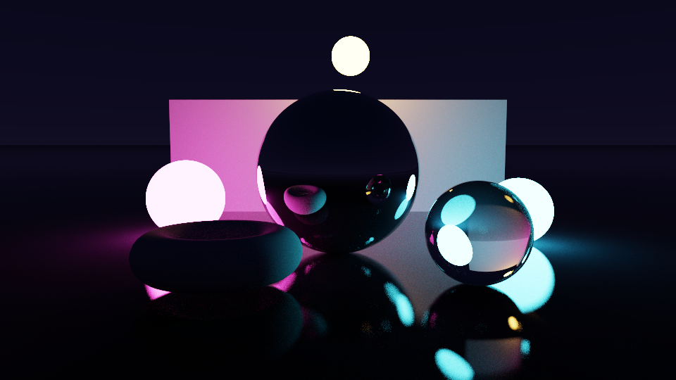

# Console Ray Tracer

A physically based **2D optics laboratory** and a **3D Monte Carlo path tracer** that run
inside your terminal, drawn with true-colour half-block characters (or retro ASCII art).
Cross-platform C++17, no dependencies beyond the standard library.

| 2D optics lab (terminal) | 3D path tracer (terminal) |
|:---:|:---:|
|  |  |

The same engines render high-resolution PNGs from the command line:

| Dispersion through a prism | Diffuse room with caustics |
|:---:|:---:|
|  |  |
| **Lenses and a curved mirror** | **Lasers, mirrors, a diamond** |
|  |  |
| **Showcase** | **Cornell box** |
|  |  |
| **Ray Tracing in One Weekend cover (BVH)** | **Neon night (sphere lights)** |
|  |  |

## Features

### 2D optics lab
* **Spectral light transport.** Every ray carries one wavelength sampled from the light's
  emission spectrum (equal-energy white, blackbody 3000 K / 6500 K, or monochromatic lasers).
  Colours come from the CIE 1931 colour-matching functions, so rainbows are real, not painted.
* **Real optics.** Snell's law, exact unpolarised Fresnel reflectance, total internal reflection,
  Cauchy dispersion `n(λ) = A + B/λ²` (BK7 glass, water, diamond and an exaggerated "prism
  crystal"), Lambertian diffuse scattering with spectral albedo, flat/tinted/rough mirrors,
  absorbers.
* **Shapes:** boxes, circles, triangular prisms, biconvex lenses (CSG of two discs), thin walls
  and curved arc mirrors. **Lights:** point, spot, laser, collimated beam.
* **Light-in-flight rendering:** every ray segment is splatted into an HDR buffer with
  anti-aliased, energy-conserving line rasterisation. Intensity falls off as 1/r purely from ray
  density; lit matte surfaces glow. Progressive accumulation, automatic exposure, ACES tone mapping.
* **A real editor:** place, drag, aim, rotate, resize, recolour, duplicate and delete objects with
  the mouse and keyboard; 100-step undo/redo; save/load human-readable scene files;
  six demo scenes (including a tribute to the original v1 scene); PNG screenshots.

### 3D path tracer
* Unidirectional path tracing with **next event estimation** (sun + area lights, cone sampling
  for spherical emitters), Russian roulette, firefly clamping for caustic paths.
* Materials: Lambertian, glossy (clear-coated), rough metal, Fresnel dielectric, emissive;
  procedural checkerboard.
* Geometry: spheres, quads, boxes, smooth-shaded triangle meshes (procedural torus), infinite
  planes, all accelerated by a **binned-SAH BVH**.
* Thin-lens camera with **click-to-focus depth of field**, free-flight WASD + mouse controls,
  progressive refinement up to 4096 spp, adjustable bounce count and exposure.
* Deterministic sampling: the image does not depend on the number of threads.

### Terminal front end
* Runs in any modern terminal: Windows Terminal / Windows 10+ console, Linux and macOS
  terminals. Native Win32 console input on Windows, raw termios + SGR mouse on POSIX.
* Each character cell shows two square pixels (`▀` with separate foreground/background colours);
  press `v` for an ASCII-art style instead. 24-bit colour with a 256-colour fallback (`--256`).
* Differential screen updates with colour tolerance and synchronised output keep the byte stream
  small; the frame rate adapts to whether you are interacting or just watching the image converge.
* Mouse everywhere, context help (`F1`/`h`), toasts, status bar, resizable layout.

## Building

Requirements: CMake ≥ 3.16 and a C++17 compiler (GCC 9+, Clang 10+, MSVC 2019+, MinGW-w64).

```bash
cmake -S . -B build -DCMAKE_BUILD_TYPE=Release
cmake --build build --config Release -j
ctest --test-dir build -C Release --output-on-failure   # 41 unit tests
./build/raytracer                                        # build\Release\raytracer.exe with MSVC
```

`build.sh` and `build.bat` wrap the same commands. Useful CMake options:
`-DCRT_NATIVE=ON` (optimise for your CPU), `-DCRT_WARNINGS_AS_ERRORS=ON`, `-DCRT_BUILD_TESTS=OFF`.

## Usage

```text
raytracer [options]                interactive mode (2D optics lab, Tab switches to 3D)
raytracer render2d [options]       render a 2D optics scene to PNG
raytracer render3d [options]       render a 3D scene to PNG
raytracer bench [--seconds S]      measure rendering throughput
raytracer list                     list the built-in scenes
```

Examples:

```bash
raytracer --scene lenses                       # open a 2D demo
raytracer --scene scenes/periscope.scene       # open (and later save to) a scene file
raytracer --3d --scene cornell                 # start in the path tracer
raytracer render2d --scene room --width 1920 --rays 50000000 -o room.png
raytracer render3d --scene showcase --width 1920 --height 1080 --spp 1024 -o showcase.png
```

Run `raytracer --help` for every option.

## Controls

Press **F1** (or `h`) inside the program for the complete, mode-specific list.

**2D optics lab**

| Input | Action |
|---|---|
| Left click on empty space | place the current tool; keep dragging to aim it |
| Left drag on an object | move it |
| Right click | delete the object under the cursor |
| Wheel / `q` `e` (`Q` `E` fine) | rotate |
| `1`–`9`, `0`, `←` `→` | tools: box, circle, prism, lens, wall, arc mirror, point, spot, laser, beam |
| `↑` `↓` | material of the selected shape / colour of the selected light (or of the next one) |
| `[` `]`, `+` `-` | resize, light power |
| `d`, `x`/`Del`, `c` | duplicate, delete, clear the scene |
| `u` `U` / `Ctrl+Z` `Ctrl+Y` | undo / redo |
| `Ctrl+S` `Ctrl+O` (`F5` `F9`) | save / load the scene file |
| `,` `.`, `a`, `g`, `Space` | exposure, auto exposure, object fills, pause |
| `n` `N`, `p` | next / previous demo, PNG screenshot |

**3D path tracer**

| Input | Action |
|---|---|
| `W` `A` `S` `D`, `R` `F` | move (hold Shift for 4×), up / down |
| arrows or left-drag | look around |
| left click, `t` | focus on the clicked / central object |
| `z` `x`, `[` `]` | aperture (depth of field), field of view |
| `,` `.`, `b`, `c` | exposure, max bounces, reset camera |
| `n` `N`, `p` | next / previous scene, PNG screenshot |

**Everywhere:** `Tab` switches mode, `v` toggles half-block/ASCII, `Esc Esc`, `Ctrl+C` or `F10` quits.

## Project layout

```text
src/core     math, colour, spectrum, RNG, images + PNG encoder, thread pool
src/optics   2D scene model, materials, shapes, lights, light tracer, presets, overlay
src/rt       3D primitives, BVH, camera, materials, path tracer, presets
src/term     terminal abstraction (POSIX / Win32), input parser, canvas, presenter
src/ui       shared widgets: panels, status bar, help overlay
src/app      interactive modes, application shell, command line
tests        unit tests (tiny built-in framework, no dependencies)
scenes       example 2D scene files
docs         architecture notes, scene format, images
```

More detail: [docs/ARCHITECTURE.md](docs/ARCHITECTURE.md) · [docs/scene-format.md](docs/scene-format.md) ·
[CHANGELOG.md](CHANGELOG.md) (including everything that changed since the 2020 version).

## Performance

`raytracer bench` on a 4-core cloud VM (GCC 13, Release): the 3D path tracer traces 5–9 million
paths per second (a terminal-sized view refines at roughly 1000 samples per pixel per second);
the 2D light tracer traces 1–5 million rays per second at terminal resolution.
